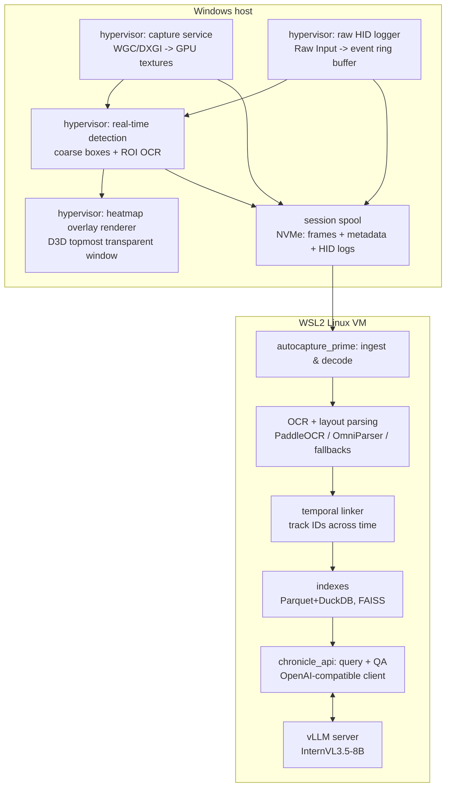
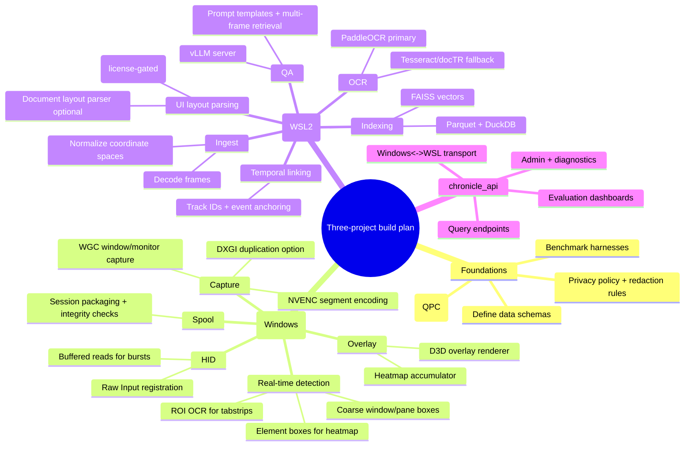

# Project autocapture_prime

_Excerpt from `deep-research-report.md`. Scope: WSL2 idle-time deep processing, OCR/layout parsing, multi-screenshot QA, and vLLM tuning. For capture/HID/overlay on Windows, see `hypervisor.md`._

## Executive summary

This report proposes a three-project architecture that uses a local vision-language model served by vLLM inside WSL2 on an RTX 4090, while keeping ultra-low-latency screen capture and raw HID telemetry on the Windows host where the relevant capture and input APIs exist. WSL2 runs a Linux kernel inside a lightweight VM, so Windows-native capture and HID logging should be implemented on Windows and then streamed/spooled to WSL2 for heavy parsing and QA. 

The three projects are:

- **Project hypervisor** (Windows host): GPU-path capture at 7680×2160, raw HID capture, and real-time UI element detection sufficient to generate a short-horizon interaction heatmap overlay. Recommended core APIs are Windows Graphics Capture (modern, performant screen/window capture with GPU textures), DXGI Desktop Duplication (fast display capture with GPU surfaces and dirty regions), and Raw Input (device-level keyboard/mouse/HID).   
- **Project autocapture_prime** (WSL2): idle-time deep processing of the captured time series—OCR, layout parsing, element classification, temporal linking, and local QA over one or many screenshots using vLLM + InternVL3.5-8B. Strong candidates for OCR/layout are PaddleOCR 3.x (PP-OCRv5 + PP-StructureV3) and GUI-centric parsing via OmniParser (for interactable/icon regions where license constraints allow).   
- **Project chronicle_api** (Windows↔WSL2 boundary): a stable “contract layer” (data schemas + ingestion + query APIs) that decouples capture cadence from deep processing, and presents OpenAI-compatible endpoints and local query UX. vLLM already provides an OpenAI-compatible HTTP server (`vllm serve`) and supports multimodal inputs (including image URLs and optional embedding inputs with explicit safety caveats). 

Key design implications for 7680×2160: a single uncompressed BGRA frame is ~63.28 MiB; at 30 FPS that is ~1.85 GiB/s and at 60 FPS ~3.71 GiB/s, which is typically too expensive to move across the Windows↔WSL2 boundary uncompressed. This strongly favors (a) keeping real-time overlay computations on Windows, and (b) shipping compressed frames or sparsified derivatives (dirty rectangles, crops, embeddings, OCR deltas) into WSL2 for deeper analysis. (Measured by calculation from resolution and 4 bytes/pixel.)

For GPU inference: NVIDIA’s CUDA-on-WSL guidance emphasizes installing **only** the Windows NVIDIA driver (R495+ for CUDA on WSL2) and **not** installing a Linux display driver inside WSL; use the WSL-Ubuntu CUDA toolkit packages to avoid overwriting the stubbed `libcuda.so`. vLLM’s core performance advantages come from PagedAttention (KV-cache paging) and continuous batching; its quantization support matrix indicates Ada (SM 8.9, RTX 4090) supports AWQ, GPTQ, Marlin, FP8, INT8, and bitsandbytes among others.

## Platform assumptions and performance targets

### Hardware and software environment assumptions

Assumptions below are explicitly stated; anything not listed is **unspecified** and should be confirmed before hypervisor/autocapture_prime optimization.

**Assumed hardware**
- Single RTX 4090 (Ada / SM 8.9) dedicated for both capture-adjacent GPU work (Windows) and LLM/VLM inference (WSL2). (Compute capability mapping for Ada is referenced in vLLM quantization docs.)   
- Display resolution is 7680×2160 (likely ultrawide dual-4K); HDR status is unspecified.

**Assumed Windows / WSL2 baseline**
- WSL2 (not WSL1). WSL2 uses virtualization technology to run a Linux kernel inside a lightweight utility VM.   
- CUDA on WSL2 is enabled via the Windows NVIDIA driver; NVIDIA recommends latest Windows x86 production driver; R495+ provides CUDA-on-WSL2 support, and you must not install a Linux display driver in WSL.   
- WSL networking mode is **unspecified**: default NAT vs the newer “mirrored mode.” Mirrored mode enables Windows host↔WSL2 connectivity via `localhost` without IP discovery; default NAT typically requires IP handling. 

**Assumed model serving**
- vLLM is the serving runtime in WSL2.
- InternVL3.5-8B is the primary multimodal model (image-text). vLLM “Recipes” explicitly documents launching InternVL3.5 in vLLM via `vllm serve OpenGVLab/InternVL3_5-8B --trust-remote-code` and provides OpenAI-client examples for image chat.   
- InternVL3.5 series supports up to a 32K context window (per InternVL3.5 paper and discussion).   
- Model license: the OpenGVLab/InternVL3_5-8B model card states Apache-2.0 for the project and notes it uses Qwen3 under Apache-2.0. 

### Performance targets

Because you did not specify capture FPS or end-to-end latency SLOs, targets below are proposed as **engineering goals** bounded by calculable bandwidth and the known properties of the capture APIs.

**Capture subsystem (hypervisor) targets (proposed)**
- **Frame acquisition latency (GPU texture available)**: target p50 ≤ 8 ms, p95 ≤ 16 ms for full-screen capture at 7680×2160. (Rationale: Windows Graphics Capture is designed as a modern, performant approach; DXGI duplication provides GPU surfaces and dirty rectangles—both support low-latency pipelines, but concrete ms numbers are workload-specific.)   
- **HID event ingestion latency**: target p50 ≤ 1 ms from WM_INPUT arrival to ring-buffer append; use buffered raw input reads for bursty devices when needed.   
- **Real-time detection latency**: target ≤ 20 ms budget per “detection tick” for window/pane-level boxes; finer-grained element parsing can be amortized or triggered on interaction. (No single authoritative benchmark exists for your exact UI mix; treat as tuning target.)

**Idle-time pipeline (autocapture_prime) targets (proposed)**
- **OCR throughput**: target ≥ 2–5 full frames/second during idle processing, with adaptive downscaling and ROI extraction. PaddleOCR 3.0 reports large latency reductions on certain models when “high-performance inference” is enabled (e.g., PP-OCRv5_mobile_rec latency reduced by 73.1% on NVIDIA T4), implying substantial headroom via configuration and model selection, but the exact throughput on RTX 4090 must be measured.   
- **Temporal linking**: target incremental update per frame ≤ 50 ms for typical UI scenes using IOU-based tracking plus event-guided alignment (mouse clicks, focus changes), with periodic global re-sync.
- **QA latency**: for single screenshot Q&A, target p50 ≤ 2.5 s and p95 ≤ 6 s including image preprocessing and vLLM scheduling; for multi-screenshot QA, target p50 ≤ 6 s and p95 ≤ 15 s with retrieval narrowing. (These targets must be tuned against vLLM batching/queueing knobs; vLLM guidance notes that lowering batching parameters can reduce latency at the cost of throughput.) 

### Why uncompressed cross-boundary streaming is a non-starter at high FPS

A single 7680×2160 BGRA frame is:

- 7680 × 2160 × 4 bytes = 66,355,200 bytes ≈ **63.28 MiB**.

Bandwidth required (uncompressed):

| FPS | MiB/s | GiB/s |
|---:|---:|---:|
| 1 | 63.28 | 0.062 |
| 5 | 316.41 | 0.309 |
| 10 | 632.81 | 0.618 |
| 30 | 1898.44 | 1.854 |
| 60 | 3796.88 | 3.708 |

This motivates: (a) do overlay/render on Windows, (b) compress frames (NVENC lossless/near-lossless) or store to local NVMe as a spool, and (c) pass structured deltas/metadata into WSL2. NVENC HEVC lossless is explicitly documented as supported in NVIDIA’s NVENC application note, and the Video Codec SDK provides the encode/decode APIs. 

### Clarifying questions before optimizing the hypervisor and autocapture_prime repos

1. What is the required **capture cadence** for the “short-term interaction heatmap” (e.g., 10 FPS continuously, or event-triggered capture around clicks/keystrokes)?  
2. Is the target display pipeline **HDR**, multi-monitor, or mixed-DPI? (Capture API choice and pixel formats can change materially.)   
3. Is your VDI environment “full desktop in a window,” “seamless apps,” or browser-based VDI? (This determines how much you can rely on Windows UI Automation vs purely optical parsing.)   
4. What are your **privacy constraints**: storage retention (hours/days), encryption requirements, and whether raw keystrokes may be stored at all (vs redacted/tokenized)? (UI Automation and screen capture mechanisms can be considered sensitive in many enterprise environments.)   
5. How do you want Windows↔WSL2 to communicate: file spool on NVMe, shared memory equivalent, or socket streaming? Are you on WSL “mirrored networking mode” (so `localhost` works both directions) or default NAT?   
6. For InternVL3.5-8B in vLLM, do you require **trust_remote_code** in production, or do you prefer the HF-formatted variant that may reduce that requirement (where available)? (This impacts compliance posture and reproducibility.)

## Subsystem design for idle-time deep processing and QA

### autocapture_prime pipeline stages

The autocapture_prime pipeline should process a time series of capture artifacts (frames + HID + optional UIA events) into a searchable, temporally-linked “UI memory.” The design below emphasizes maximal information extraction while keeping the Windows-side capture loop lightweight.

**Stage ingestion**
- Read capture sessions (frames + metadata + HID logs).
- Decode frame format (PNG/lossless HEVC/etc.) into a canonical tensor layout.
- Align timestamps by the Windows QPC-based capture timestamp embedded in metadata. QPC is the recommended high-resolution timer for native code. 

**OCR and text normalization**
- Run OCR at multiple resolutions: full-frame downscaled pass for large text + ROI pass for small text (tab titles, timestamps).
- Normalize output into (text, bounding box, confidence, language, reading order).

**Layout parsing and element graph construction**
- Produce a UI element graph per frame: nodes for text runs, icons, panes, windows; edges for containment and adjacency.
- Where VDI content exists, rely on optical parsing (icons, text blocks). OmniParser is explicitly designed to convert UI screenshots into structured elements with bounding boxes and local semantics.   
- For document-like panes (email bodies, shared PDFs), optionally use document layout tooling (LayoutParser) in addition to GUI parsing (design recommendation). 

**Element classification**
- Classify each node into a controlled taxonomy: tab, address bar, message list item, chat transcript bubble, terminal prompt, code block, etc.
- Combine visual cues + OCR tokens + icon captions. OmniParser’s approach explicitly pairs interactable region detection with icon description captions. 

**Temporal linking**
- Link elements across time: stable IDs for windows, panes, and repeated widgets.
- Use event-guided correspondence: pointer clicks and focus changes can anchor which element was “active” at a time; optional UI Automation event streams provide structure-change and other event categories, but availability varies across apps and remote contexts. 

**Indexing and QA**
- Store structured outputs in columnar storage for fast time-sliced queries and joins.
- Build text and multimodal indices for retrieval-augmented QA.
- Serve QA via vLLM OpenAI-compatible API and/or direct offline API.

### OCR and layout parsers with explicit model/version candidates

**Primary OCR stack: PaddleOCR 3.x**
- PaddleOCR 3.0 technical report presents PP-OCRv5 (multilingual recognition), PP-StructureV3 (hierarchical document parsing), and PP-ChatOCRv4 (KIE + LLM integration).   
- PaddleOCR’s repository notes recent releases (e.g., 3.4.0 on 2026-01-29) and highlights CUDA 12 support for high-performance inference plus ONNX Runtime/Paddle inference backends.   
- The technical report provides concrete evidence of latency reductions under “high-performance inference” for specific models on NVIDIA T4, indicating the framework explicitly targets speed/efficiency tuning.   

**Fallback OCR engines**
- **Tesseract**: Apache-2.0 licensed, widely deployed OCR engine; useful as a deterministic baseline and for narrow fonts, but GPU acceleration is not inherent.   
- **docTR (mindee/doctr)**: Apache-2.0 licensed deep-learning OCR library, candidates for bounding-boxed word-level outputs; useful if PaddleOCR model selection does not meet quality needs for specific fonts/scripts. 

**GUI parsing / element detection**
- **OmniParser V2 checkpoints** (for GUI element parsing) are explicitly released by Microsoft Research; the repo documents how to download v2.0 weights and notes the split licensing between icon detection (AGPL via YOLO) and caption models (MIT).   
- **UIED** offers an Apache-2.0 licensed element detection pipeline, but it historically used Google OCR for text detection; for fully local processing, you would replace that text detector with a local OCR model (design recommendation). 

### Multi-screenshot QA using vLLM and InternVL3.5-8B

**Serving interface**
- vLLM provides an HTTP server implementing OpenAI’s Completions and Chat APIs (`vllm serve`), plus it documents CLI args including `--host`, `--port`, and `--uds` (Unix domain socket).   
- vLLM Recipes provides an InternVL3.5 guide with a minimal launch command and OpenAI-client examples to send text and image_url messages.   

**Multimodal scaling constraints**
- InternVL3.5 paper describes efficiency work such as Visual Resolution Router (ViR) and Decoupled Vision-Language Deployment (DvD) for balancing compute; DvD is most applicable in multi-GPU settings, but the “dynamic resolution” idea is relevant even on single GPU as a prompt-side policy (feed smaller crops when possible). 

**Embedding-based retrieval**
- For multi-screenshot QA, avoid feeding dozens of full screenshots into the model; instead retrieve the top-k frames and crops by time and relevance.
- vLLM supports multimodal embedding inputs in online serving when enabled with `--enable-mm-embeds`, but warns it should be enabled only for trusted users and the engine may crash on incorrect shapes. This is relevant if you split vision encoding from language inference or precompute embeddings. 

### Temporal alignment and indexing strategies

**Time base**
- Use QPC-derived timestamps for both frames and HID events. Microsoft provides guidance for acquiring high-resolution timestamps and documents QPC for native code.   

**Structured storage**
- Store per-event and per-element facts in **Parquet**, a column-oriented format designed for efficient storage and retrieval with strong compression/encoding.   
- Use DuckDB for local analytics over Parquet; DuckDB documents efficient Parquet read/write and filter pushdown.   
- Compress large JSON-like blobs (element graphs, OCR tokens) with **Zstandard (zstd)**; RFC 8878 describes zstd as a lossless compression mechanism, and zstd’s reference site notes its format is stable and published as RFC 8878.   
- Use FAISS for vector similarity search; the FAISS repository describes GPU-capable similarity search and is MIT licensed.

## vLLM optimization on RTX 4090 under WSL2/CUDA

### CUDA/driver prerequisites and versioning constraints

NVIDIA’s CUDA-on-WSL2 user guide provides several hard constraints that affect reproducibility:

- Install the latest Windows NVIDIA driver; CUDA-on-WSL2 support is available with R495+ drivers, and NVIDIA explicitly notes this is the only driver you need—do not install a Linux display driver in WSL.   
- Use WSL-Ubuntu CUDA toolkit packages (12.x) to avoid overwriting the stubbed driver libraries, and avoid meta-packages that would attempt to install a Linux NVIDIA driver inside WSL.   
- Microsoft’s CUDA-on-WSL guidance also calls out kernel version requirements (e.g., ≥ 5.10.43.3) and links back to NVIDIA’s user guide; it is updated as of 2025-09-18.   

### vLLM performance levers grounded in primary sources

- vLLM’s PagedAttention paper reports throughput improvements of 2–4× at the same latency compared to then-state-of-the-art systems in their evaluation, driven by efficient KV-cache paging and reduced fragmentation.   
- vLLM’s own repository lists continuous batching, CUDA graph execution, and multiple quantization formats as core features.   

**Low-latency tuning knobs**
- vLLM community guidance suggests lowering batching parameters (e.g., `--max-num-batched-tokens` and limiting `--max-num-seqs`) to reduce queueing delays for real-time use, with a throughput tradeoff.   

**Quantization on RTX 4090 (Ada / SM 8.9)**
- vLLM’s quantization documentation explicitly maps Ada to SM 8.9 and lists supported quantization formats; on Ada, AWQ, GPTQ, Marlin, INT8, FP8, and bitsandbytes are shown as supported in the compatibility table.   
- Practically, you should validate that any chosen quantization retains the OCR/GUI reasoning fidelity you need; published head-to-head quality numbers for InternVL3.5-8B quantizations in your UI domain are **no evidence** in the sources reviewed.

### Comparing inference runtimes (for decision hygiene)

You asked for a comparison table, even though your requirement is to rely on vLLM. The table below is therefore framed as “alternatives you may benchmark against vLLM” rather than suggesting you must switch.

| Runtime | Latency/throughput claims | Multimodal support positioning | Ease of integration | License signals |
|---|---|---|---|---|
| vLLM | PagedAttention paper reports 2–4× throughput improvements vs baselines; supports continuous batching.  | Has multimodal inputs support and vision-language examples; Recipes include InternVL3.5 launch+API.  | OpenAI-compatible server built-in (`vllm serve`).  | (Project license not assessed here; not in retrieved sources.) |
| TensorRT-LLM | GitHub describes state-of-the-art optimizations: inflight batching, paged KV caching, quantization, etc.  | Primarily NVIDIA-optimized inference; multimodal depends on model support and workflow. (No definitive “supports InternVL3.5” evidence here.) | Higher build/engine complexity; NVIDIA docs exist.  | GitHub repo exists under NVIDIA org; license details require review per install docs.  |
| SGLang | GitHub describes high-performance serving for LLMs and multimodal models.  | Explicitly includes multimodal in its positioning.  | Separate programming model; benchmark tooling exists.  | Apache-2.0 on GitHub.  |
| LMDeploy | GitHub claims up to 1.8× higher request throughput than vLLM and lists features like continuous batching and blocked KV cache.  | Supports serving LLM/VLM and OpenAI-compatible APIs (docs).  | Different engine families (TurboMind/PyTorch).  | (License not confirmed in retrieved sources; review required.) |
| llama.cpp | GitHub states goal is minimal-setup local inference across hardware; MIT license.  | Multimodal support exists in ecosystem, but InternVL3.5/vLLM-style VLM workflows are not evidenced here. | Very different integration path (GGUF etc.). | MIT license.  |

## Integration architecture, data formats, and security considerations

### End-to-end architecture

(Architecture is derived from WSL2 virtualization constraints and vLLM’s OpenAI-compatible serving model.) 

### Data formats for screenshots and HID logs

**Frame formats (recommended)**
- **In-memory canonical**: GPU texture in a DXGI/Direct3D format during capture; only copy to CPU when necessary. DXGI duplication delivers frames as DXGI surfaces, enabling GPU processing.   
- **Inter-process / on-disk**:
  - **Lossless/near-lossless video** for high-cadence segments using NVENC (HEVC lossless is supported per NVENC application note).   
  - **Lossless stills** (PNG or equivalent) for event-triggered captures where fidelity is paramount. (No single authoritative source in this set; treat as design.)
- **Pixel format**: NV12 is documented as the preferred 4:2:0 pixel format for DirectX video acceleration; it is a good interchange format for GPU-accelerated encode/decode pipelines.   

**HID log formats (recommended)**
- **Raw event stream**: store key fields from RAWINPUT (device handle/ID, event type, scan code, flags, mouse delta/buttons, timestamp). RAWINPUT struct fields for mouse/keyboard/HID are documented.   
- **Serialization**:
  - **Protocol Buffers** for compact, schema-evolvable binary logs (“smaller and faster than JSON” per Protobuf overview; wire format documented).   
  - **Zstandard** compression for batch files and metadata blobs; RFC 8878 specifies zstd as a lossless mechanism.   
- **Analytical store**: Parquet for event tables and derived features; Parquet is column-oriented and designed for efficient retrieval.   

### Storage, retention, and security/privacy

Your system collects inherently sensitive artifacts (screenshots + input telemetry). At minimum:

- **Least retention**: keep raw frames for the minimum window necessary to extract structured facts; retain only derived, redacted summaries when possible (design recommendation).
- **Encryption at rest**: encrypt raw capture stores per enterprise policy; store keys in OS-native key stores (design recommendation; no direct source in this set).
- **Access control**: restrict vLLM multimodal embedding endpoints and any “raw frame fetch” endpoints to trusted local callers; vLLM explicitly warns that enabling multimodal embedding inputs can crash the engine if incorrect shapes are passed and should be enabled only for trusted users.   
- **UI Automation risk**: if you use UI Automation to collect metadata, it has abuse potential; security research has shown UI Automation can be used as an attack technique to evade some EDR detection if abused, so enterprise environments may treat UIA-based tooling as high-risk.

## Testing methodology, metrics, and prioritized implementation roadmap

### Benchmarking and metrics

**Capture pipeline (hypervisor)**
- **Frame acquisition latency**: timestamp at capture API “frame arrived” and when the GPU texture is ready for downstream use; WGC free-threaded frame pool semantics support worker-thread delivery for capture callbacks.   
- **Dirty-rect efficiency**: for DXGI duplication, measure % of frame area updated per tick and compute CPU/GPU savings from ROI-only processing; DXGI duplication is built for frame-by-frame updates and supports collaboration/remote access scenarios.   
- **HID ingestion**: validate no dropped events under burst (use GetRawInputBuffer when needed).   

**Detection and overlay**
- Bounding-box accuracy: IoU vs annotated ground truth for key UI types; include “small icon” evaluation since that is a known failure mode addressed by OmniParser updates.   
- Heatmap correctness: click-to-element attribution accuracy; “time-to-overlay” for interactive feedback.

**autocapture_prime**
- OCR accuracy: CER/WER and field-level extraction F1 on a curated set of screenshots ordered by application type (browser, Teams, terminal, Outlook/VDI).
- Latency profiling per module: PaddleOCR 3.x explicitly supports benchmarking and per-module latency reporting in its release notes.   
- Temporal linking: track continuity score (ID switches per minute) and alignment error vs HID anchors.

**QA**
- Measure p50/p95 end-to-end response time and hallucination rate on a fixed evaluation set; vLLM’s core throughput/latency behavior depends on KV cache management and batching policy.   

### Hierarchical task plan

(Plan structure follows the constraints and capabilities documented for CUDA-on-WSL2, Windows capture APIs, and vLLM serving.) 

### Prioritized roadmap with milestones and estimated effort

Effort estimates below assume one senior engineer with occasional support; actual delivery depends heavily on capture cadence targets, enterprise restrictions, and licensing constraints.

**Milestone A: Capture + HID + spool “truth pipeline” (2–4 weeks)**
- Implement WGC capture for the primary display and/or selected windows; use free-threaded frame pool; validate 8K stability.   
- Implement Raw Input logging + QPC timestamps; buffered mode for bursts.   
- Write spool format v0: frames + metadata + HID logs (Protobuf + zstd, Parquet for summary tables).   

**Milestone B: Real-time coarse detection + heatmap overlay (3–6 weeks)**
- Start with geometry-only element mapping (click heatmap per pixel/region) to validate overlay loop.
- Add ROI OCR for tabstrips using PaddleOCR in a Windows-native service or via WSL2 batch (depending on boundary cost).   
- Add GUI element detector (license decision point):  
  - If OmniParser icon_detect licensing (AGPL) is acceptable, integrate OmniParser V2 detection + caption model path.   
  - Otherwise, prototype UIED (Apache-2.0) for element boxes and replace its remote OCR dependency with local OCR.   

**Milestone C: autocapture_prime OCR + layout + temporal linking (4–8 weeks)**
- Implement PaddleOCR-based OCR + structured output (reading order, word boxes); enable performance benchmarking and tune.   
- Implement layout parsing: OmniParser where possible; document-layout parsing (LayoutParser) for PDF/email-like content if needed.   
- Implement temporal linking: event-anchored linking using QPC timestamps and HID events.   

**Milestone D: vLLM + InternVL3.5-8B serving and QA (3–6 weeks)**
- Stand up vLLM OpenAI-compatible server in WSL2; validate InternVL3.5 recipe.   
- Tune for latency vs throughput via batching knobs; validate under realistic multi-request workloads.   
- Add multi-screenshot retrieval: Parquet time-slicing + FAISS vector search.   

**Milestone E: Hardening, privacy controls, and regression suite (ongoing, 2–6 weeks)**
- Implement redaction filters and retention rules; document threat model (UIA risk).   
- Build regression datasets: 100–500 annotated UI frames across target apps; track detection/OCR/QA metrics and alert on regressions.
- Validate WSL2 driver/toolchain invariants against NVIDIA’s WSL guide (no Linux driver installs; correct toolkit packages).
